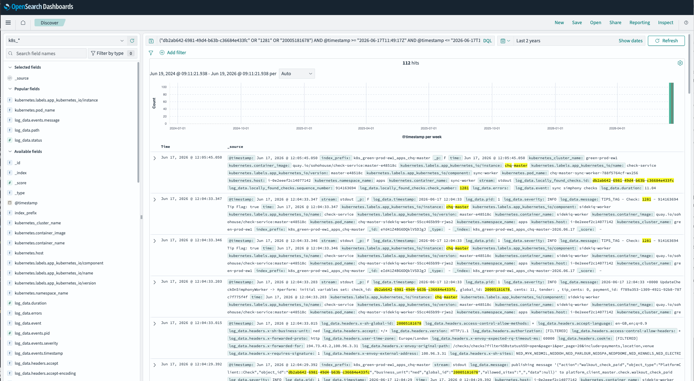

# OpenSearch Log Timeline

Converts one or more OpenSearch/Kibana "On_demand_report" `.xlsx` exports into standalone interactive HTML timeline pages. Each output file is fully self-contained with no external dependencies.

---

## Requirements

- Ruby >= 2.7
- [`roo`](https://github.com/roo-rb/roo) gem
- `template.html` in the same directory as `log_timeline.rb`

---

## Installation

```sh
gem install roo
```

Clone or download the repository so that `log_timeline.rb` and `template.html` are in the same directory.

---

## Usage

There's a pre-use tasks to create a query from a given check

```ruby
record = Persistence::HousepayCheckSummer25.find('db2ab642-6981-49d4-b63b-c36684e433fc')

def build_dql_query(record, time_field: "@timestamp", instance: "chq-master")
  values = [record[:id], record[:check_number], record[:global_id]].compact

  raise ArgumentError, "No identifiers present on record" if values.empty?

  value_clause = "(#{values.map { |v| %("#{v}") }.join(' OR ')})"

  clauses = [value_clause]

  if record[:created_at]
    start_time = record[:created_at].utc.iso8601
    end_time   = (record[:updated_at] || record[:created_at]).utc.iso8601
    clauses << "#{time_field} >= \"#{start_time}\""
    clauses << "#{time_field} <= \"#{end_time}\""
  end

  clauses << %Q(kubernetes.labels.app_kubernetes_io/instance: "#{instance}")

  clauses.join(' AND ')

  puts build_dql_query(record)
end
```

This will result in a small query that can be used to generate a report in Kibana. Once the report is generated, it can be exported as an `.xlsx` file and processed with `log_timeline.rb`.

```
("db2ab642-6981-49d4-b63b-c36684e433fc" OR "1281" OR "20005181678") AND @timestamp >= "2026-06-17T11:49:17Z" AND @timestamp <= "2026-06-17T12:05:45Z" AND kubernetes.labels.app_kubernetes_io/instance: "chq-master"
```

Go to Kibana > Discover > New Search > Add the query above > Run the search > Save as a report > Export as `.xlsx` file.



Save th e rsulting file locally as `report.xlsx` and run the following to generate a view.

```sh
# Single file — writes report_timeline.html next to the input
ruby log_timeline.rb report.xlsx

# Multiple files with a custom output directory
ruby log_timeline.rb --out-dir ./out *.xlsx
```

**Options:**

| Flag | Description |
|---|---|
| `--out-dir <dir>` | Write all output files into this directory instead of alongside each input file |

After processing, all generated HTML files are opened automatically via `open`.

---

## Input Format

The script reads `.xlsx` files exported from OpenSearch/Kibana's **On_demand_report** feature.

The first row of the spreadsheet must contain column headers. All columns are optional — missing ones produce a warning rather than a hard failure.

| Column | Description |
|---|---|
| `_source.@timestamp` | Kibana display timestamp, e.g. `Jun 12, 2026 @ 13:21:39.868` |
| `_source.log_data.severity` | Log severity level |
| `_source.log_data.method` | HTTP method |
| `_source.log_data.path` | Request path |
| `_source.log_data.status` | HTTP status code |
| `_source.log_data.duration` | Request duration |
| `_source.log_data.event` | Background worker event name |
| `_source.log_data.request_id` | Request identifier |
| `_source.log_data.message` | Log message (used for APNS records) |
| `_source.kubernetes.pod_name` | Kubernetes pod name |
| `_source.log_data.ip` | Client IP address |
| `_source.log_data.revenue_center.count` | Revenue center count |
| `_source.log_data.revenue_center.check_numbers` | Associated check numbers |
| `_source.log_data.started_at` | Request start timestamp |

### Record Classification

Each row is classified into one of four types based on which fields are present:

| Type | Condition |
|---|---|
| `http` | Has a `status` value |
| `worker` | Has an `event` value, no `status` |
| `apns` | Has a `message` value, no `status` or `event` |
| `other` | None of the above |

---

## Output

For each input file, the script writes:

```
<basename>_timeline.html
```

The file is placed next to the input `.xlsx` by default, or in `--out-dir` if specified.

Each HTML file is entirely self-contained — no network requests, no external CSS or JS.

### Template Substitution

The script builds each page from `template.html` by replacing these placeholders:

| Placeholder | Content |
|---|---|
| `%RECORDS_JSON%` | JSON array of all record objects |
| `%PAGE_TITLE%` | The xlsx basename |
| `%META_JSON%` | Header metadata (app name, date range, extracted identifiers) |

The **app name** is derived from Kubernetes pod names by finding the longest common leading path segment and stripping trailing k8s hash suffixes (5–10 hex characters).

---

## HTML Features

- **Vertical chronological timeline** with colored indicators by status class:
  - 2xx — green
  - 3xx — blue
  - 4xx — orange
  - 5xx — red
  - Worker — purple
  - APNS — teal
- **Filter buttons** — All, 2xx/3xx, 4xx/5xx, Background Sync, Push/APNS — each showing a live record count
- **Expandable rows** — click any entry to reveal an inline detail panel
- **Raw data modal** — the `{}` button opens a section-grouped field view with keyboard navigation (← → to move between records, Escape to close)
- **Header bar** showing the derived app name, date/time range, and any extracted identifiers (`check_number`, `global_id`, `check_id`)

---

## Development / Testing

The test suite lives in `test_log_timeline.rb` and uses Minitest (no additional setup needed beyond `gem install minitest`).

```sh
ruby test_log_timeline.rb
```

The tests stub `Roo::Spreadsheet` internally, so no real `.xlsx` file is needed to run them.

To exercise the script manually against a real export:

```sh
# Verify a single export renders without errors
ruby log_timeline.rb sample_report.xlsx

# Test multi-file processing and --out-dir
mkdir -p /tmp/timeline-out
ruby log_timeline.rb --out-dir /tmp/timeline-out *.xlsx
```

To modify the HTML output, edit `template.html`. The three placeholders (`%RECORDS_JSON%`, `%PAGE_TITLE%`, `%META_JSON%`) must remain present in the template or the substitution step will abort the write for that file.
